> 准备阶段
> 
> 1.Microsoft E5 开发者账号（管理员/子账号都可）
> 
> 2.建议使用电脑操作

# 注册应用
1. 浏览器打开 https://portal.azure.com/#home

2. 使用账号密码登录

   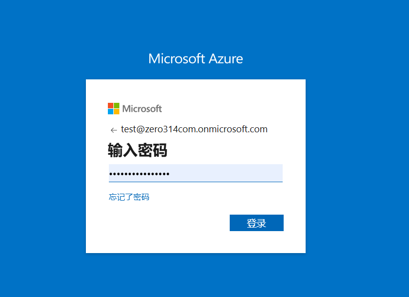

3. 可能遇到Authenticator验证，此时分2种情况，使用子账号的话请联系管理员进行批准；使用的是管理员账号的话需要自行在手机上安装Authenticator并完成账号添加、验证操作。
  
   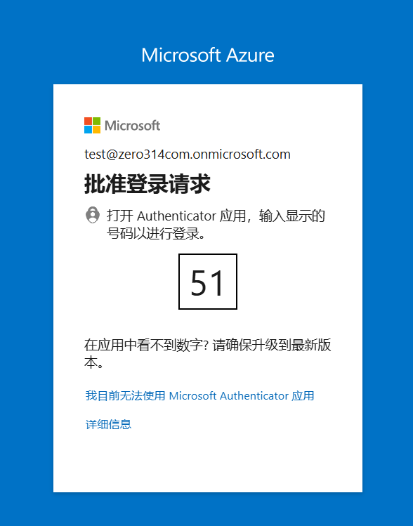
   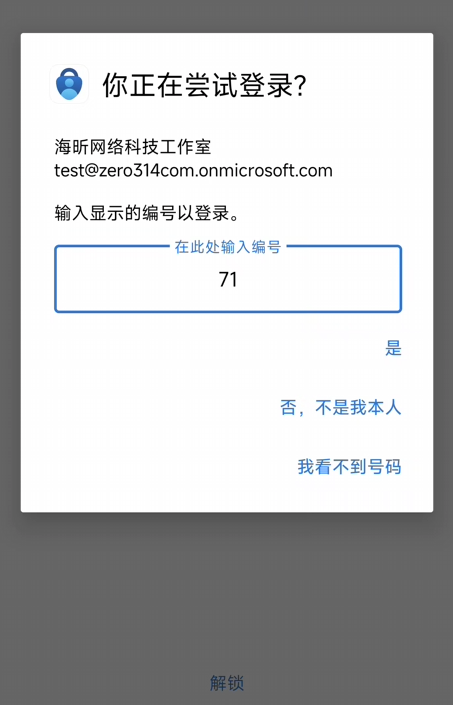

4. 登录成功后，建议勾选“是”

   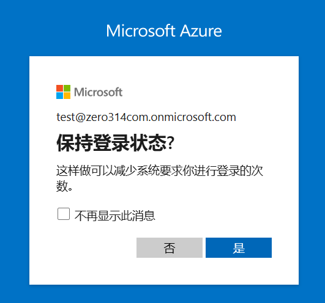

5. 搜索并打开应用注册

   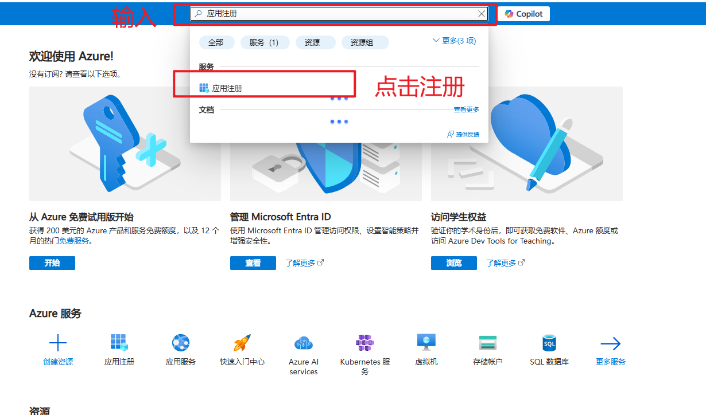

6. 点击“新注册”

   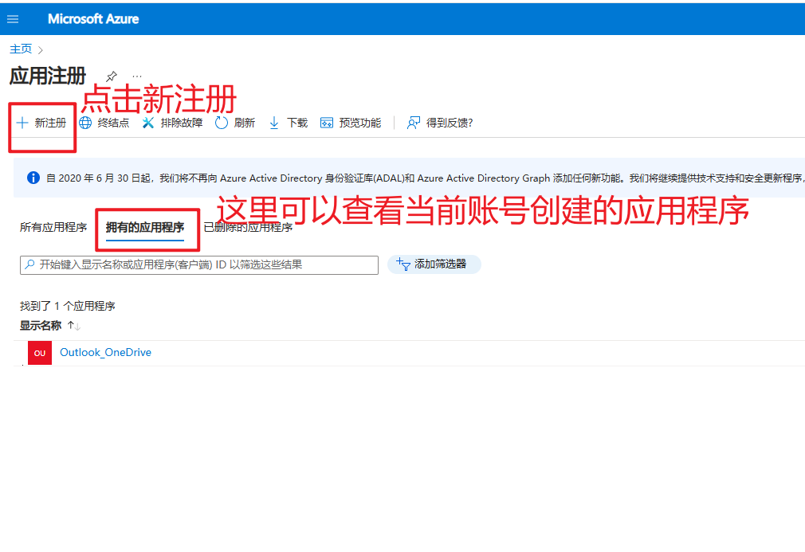

7. 填写信息并注册

   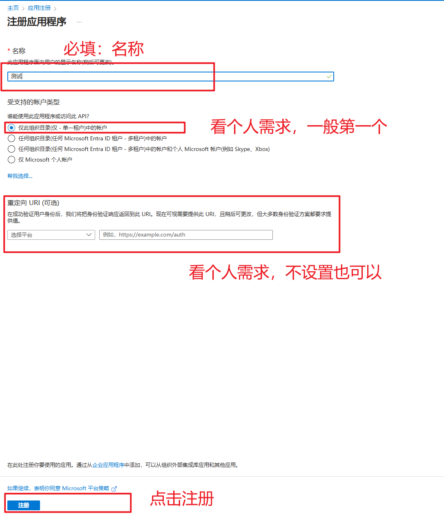

8. 注册成功之后会看到应用的信息，其中**应用程序(客户端) ID**和**目录(租户) ID**复制一下，写代码的时候用的到

   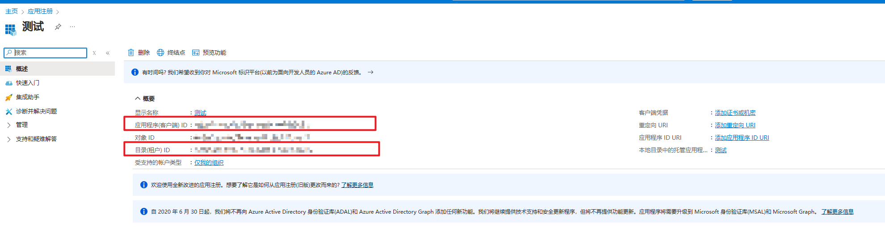

9. 设置API权限

   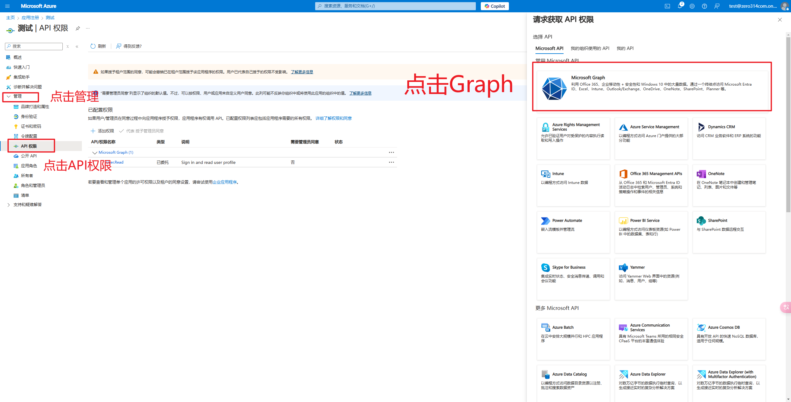

10. 选择**应用程序权限**这个类型，然后搜索需要用到的权限，勾选之后点击**添加**

   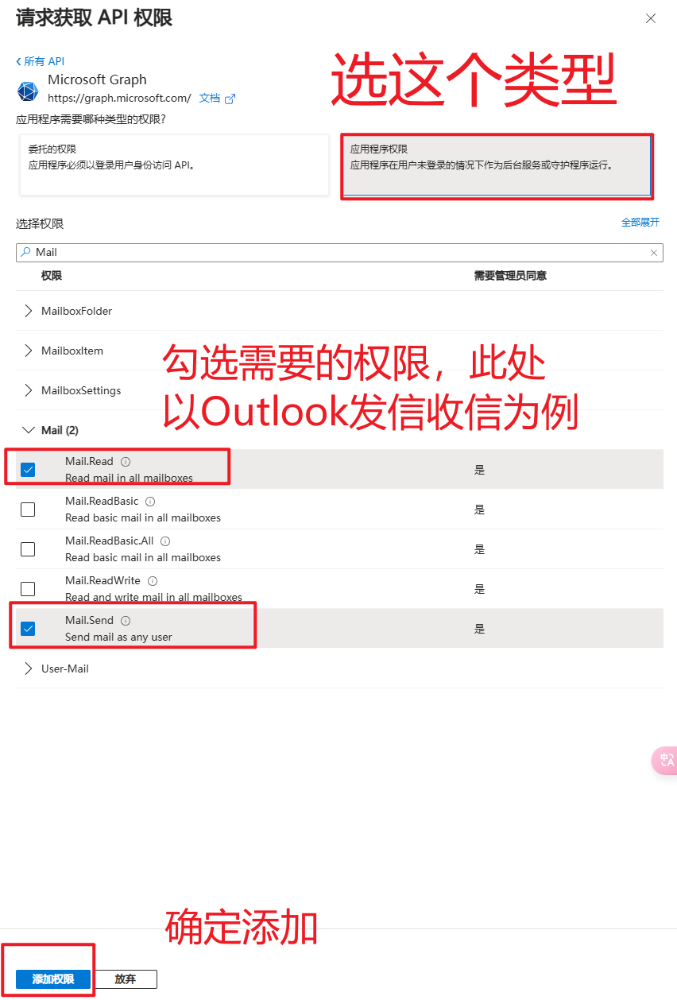

11. 有的权限默认需要管理员同意，此时，如果是管理员账号则直接可以点同意，如果是子账号则需要联系管理员进行审批，审批过程就是登录后来到这个页面，点击同意即可
   
   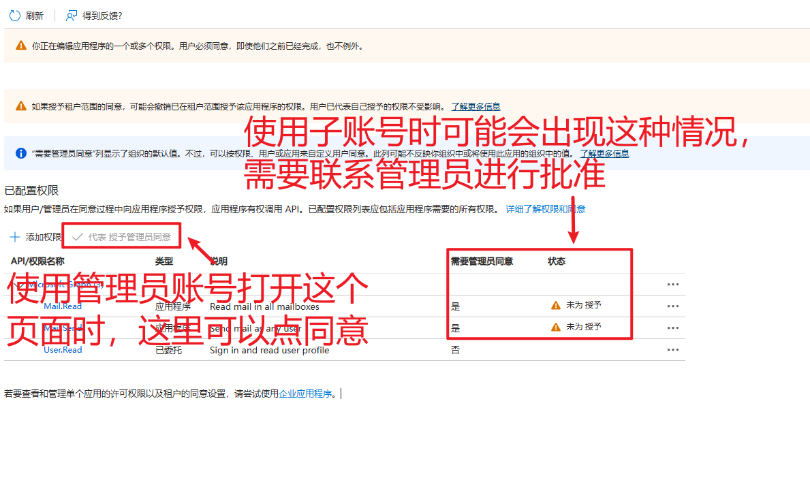

12. 还需要创建一个**客户端密钥**，如图
    
   
   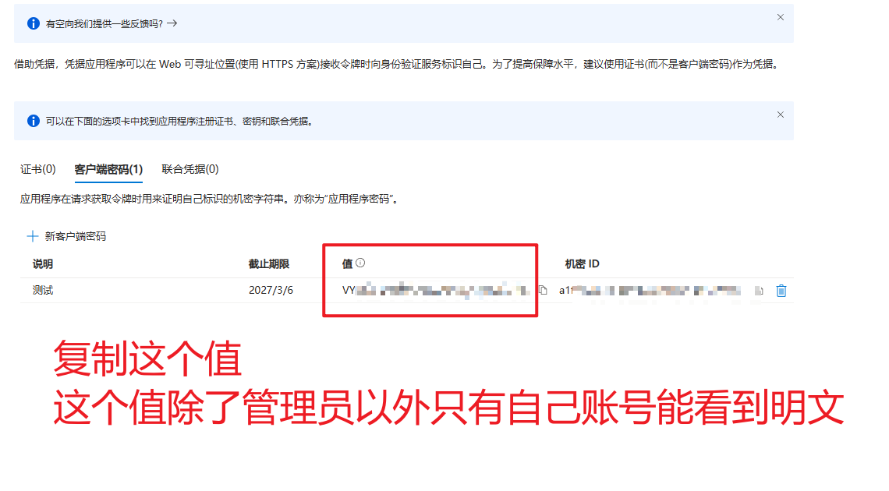

13. 至此，就可以在代码中调用API了，一共复制了3个参数，3个参数都是必须的，分别是**应用程序(客户端) ID**、**目录(租户) ID**和**客户端密钥**
